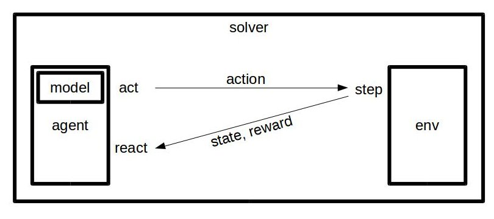

# CartPole-control
A OpenAI-CartPole solver implemented with DQN and control theory.


## Environment
* Python: 3.5.2
* tensorflow: 1.10.0
* keras: 2.2.2
* openai-gym: 0.10.5


## Usage
```shell
$ python main.py [--solver SOLVER_TYPE]
```
* `SOLVER_TYPE`: `basic`(default), `dqn`, `simple_control`, `pid_control`


## Introduction



* env: 
  Environment of problems to be solved.
* model: 
  Model of agent to behave (and learn).
* agent: 
  A player interact with environment.
* solver: 
  A problem solver controlling the interaction between agent and environment.
  (3 stages: pretraining, training, solving)


## Implemented agent
(more agents are going to be added)
* Basic agent: 
  Actions in all stage are generated by `env.action_space.sample()`.
* DQN agent: 
  Actions are determined by deep Q network.
* Simple control agent: 
  It cares about the angle of pole only.
  When pole is falling to right (angle > 0), it push the cart to right.
  Otherwise, it push the cart to left.
* PID control agent: 
  It continuously generate actions to minimized the error between measured 
  angle and desired setpoint.
  The output of PID controller is based on propotional, integral, derivative 
  terms of the error of angle.
  - P: propotional controller, its output relates to angle (unit: degree).
  - I: integral controller, its output relates to cumulated angle 
    (unit: degree*sec).
  - D: derivative controller, its output relates to variation of angle 
    (unit: degree/sec).


## Reference
* [Udacity | Q learning cart][udacity-dl-ql]
* [Github | hope-yao/cartpole][hope-yao-cartpole]
* [Github | ivPID][ivPID]


[udacity-dl-ql]: https://github.com/udacity/deep-learning/blob/master/reinforcement/Q-learning-cart.ipynb
[hope-yao-cartpole]: https://gist.github.com/tsu-nera/edd306ddeefebe4afb1efceefbc3f953
[ivPID]: https://github.com/ivmech/ivPID
